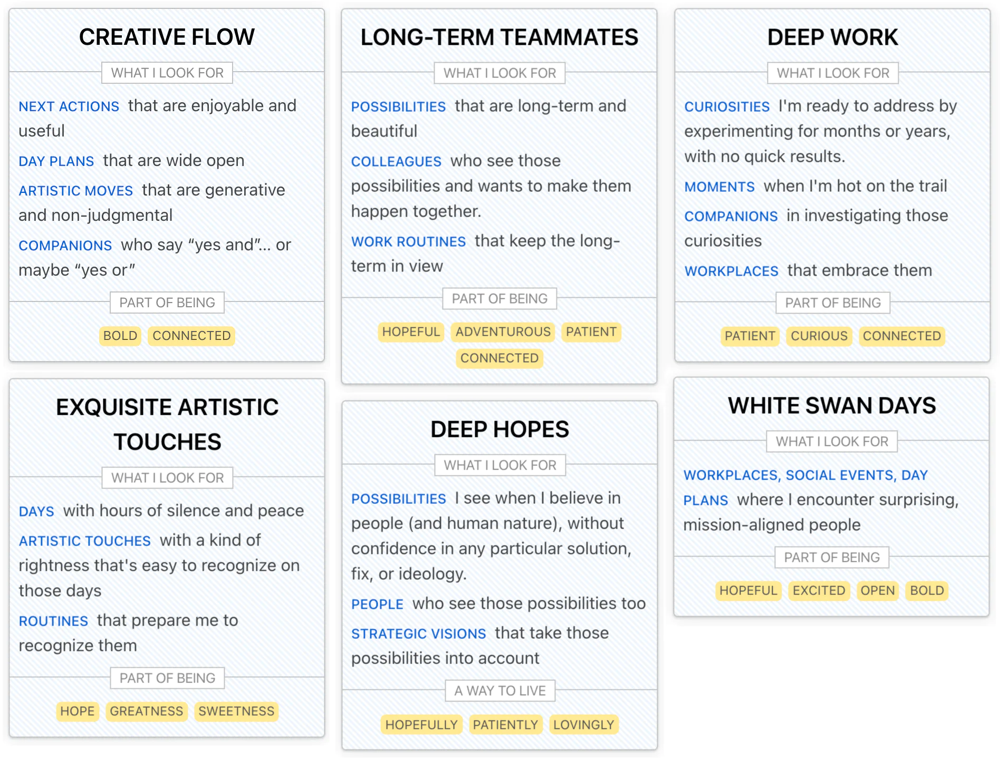
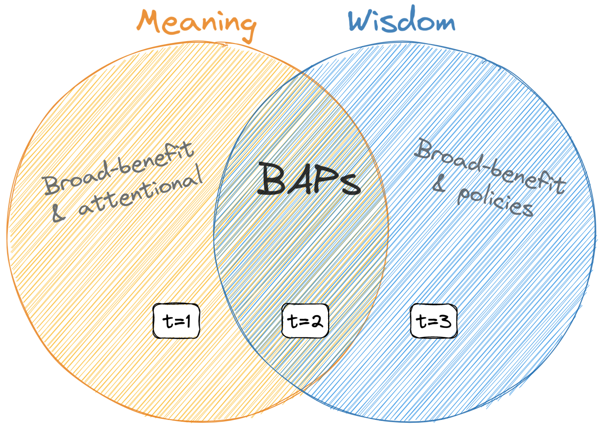

[^joe]: School for Social Design joe.edelman@gmail.com

# Introduction

**The customer's always right. The people have spoken**. These phrases show the central role of "revealed preference" in our markets and democracies. Policymakers work to serve citizens, driven by preferences revealed by ballots; product designers work to serve users-customers, driven by what's revealed by purchases and clicks.

Revealed preferences are called "engagement metrics" when summed up. A product or policy with high engagement is said to serve user-citizens most, because they choose it most. The people have spoken. The customer's always right.

This is alluringly simple. And yet: what we imagine with "values-based design" isn't exactly "engagement-maximizing design". Likewise, "values-based policy" isn't exactly populism.

Point this out, and people yell at you: Don't we know best for our own lives? Are you going to impose "better values" from above?

Here's a third option: What if people know best, and have wise values, but their engagements aren't the last word on those values? To prove this, you'd need another source of information on people's values. One that *is* the last word. But: what could be as robust as people's own revealed preferences?

Supposing we can figure *that* out, what do we mean by "values"?

**Social visions**. Sometimes people mean *visions of what's right for everyone, or for a group*—what a family should be like, how a father should behave, what a nation should be like, etc. On this definition, values would include things like inclusiveness, freedom, feminine dress-codes, etc.

**Meaning nuggets**. Other times, people mean *things that feel right and meaningful when you do them*—such as being vulnerable, taking stage, being creative, etc.

I believe we can get data about people's "meaning nuggets." As robustly as we get revealed preferences. We can use it to evolve designs and policies in service of values. To show this, I'll build on work by various philosophers and psychologists[@Sen1973; @Sen1977; @Taylor1977; @Anderson1993; @Chang2004; @Gibson1983; @Velleman1989], and say things about the role of attention in choice, meaningful experiences, and how theoretical knowledge differs from life wisdom. Because values touch on all of those things.

# On Preferences

To evolve a product to suit users, a designer needs information about users---information that serves as evidence that a product direction is an improvement. Similarly, a policymaker needs information about citizens, to justify policy directions.

Various information is collected, but the gold standard is revealed preferences, because they are:

- **Verifiable**. Engagements leave a trail. Who did you actually vote for? What did you purchase?
- **Local**. Preferences are informed by the local situations and priorities of user-citizens. Most alternatives assume outside experts know better than user-citizens what would help them.
- **Battle-tested**. We often *say* we want things, but don't choose them in the final analysis. Preferences get at our *real* priorities.
- **Fine-grained**. Preferences say subtle things about how a person wants to live.
- **Private**. Preferences are often expressed away from the signaling of allegiances, so they're less influenced by social pressure.
- **Easily-expressed**. You don't need to be particularly introspective or good with words to act on a gut feeling about what's right for you.

Despite these advantages, we have terms like *addiction, soulless consumerism, atomization*, and *populism* that describe how revealed preferences, summed up into engagement metrics, lead us astray. The problem is this: revealed preferences omit signals we'd rather collect, and collect noise we'd rather set aside:

**Lost signal**. Alex wants to move to a different city, but only if his friends also move.[See discussions of the prisoner's dilemma in e.g., @Sen1973; @Anderson2001] Alice and her friends have, unfortunately, revealed a preference for their *current* city. Ben and *his* friends want to play tennis more—but they're choosing individually, from a menu of bookable tennis experiences. It looks like a preference to play tennis separately—even a *rivalry*[@EdelmanGameB] for the same tennis court.

**Noise.** Carla buys a car because there's no local transit. This counts as a preference for cars. Dan does something he later regrets, due to social pressure, misinformation, or a manipulative ad. Preference! Eli is following a social rule which she knows is *not* in her best interest.[See @Sen1977; @Anderson1993 on 'commitment'] Preference!

In general, choices made out of thoughtlessness, misinformation, lack of coordination, or external pressure count the same as those from reflection, experience, capacity, and wisdom.

This all stings worse in some parts of life: those concerning *community* and *meaning*. That's why engagement-optimizing systems—like markets, democracies, and social media—aren't where we turn for meaning and community.

# The Nature of Choice

It's worth looking deeper at that lost signal and noise. It happens when the options we have in mind to choose from are biased or incomplete. To solve this, we can widen our conception of choice to include option-set formation[See @Smaldino2012].

Imagine I'm with colleagues, and at $t_1$, I say something witty. At $t_1$, I choose to say *that* in particular. But, at some earlier point $t_0$, I decided to invest my attention in finding witty things to say. I try witty phrases on in my mind; I test situations for witty reframings. My attentional policy of 'looking for witty quips and reframes' (adopted at $t_0$) is how I assembled the option set, used at $t_1$, for the choice of what exactly to say.

What is an *attentional policy*? By *policy*, I mean something like "taking out the trash when it's almost full", "calling mom on Sundays", or "running new contracts past the lawyer"—something done regularly, or in a certain context, without a cost-benefit analysis each time.[^policies]

[^policies]: Necessary due to bounded rationality and social coordination, just like plans, heuristics, norms, intentions, etc. [@Bratman1987; @Simon1955; @Taylor2016]

**Attentional policies (APs)**, then, are policies about how to *think* about a thing, what to *pay attention to* in a context, or *what to look for in selecting an action*. "Taking out the trash on Tuesdays" is a normal policy, but "experiencing every step and breath while doing my chores" or "looking for kind words when giving feedback"—*these* are attentional policies.

APs can be about how to treat people[^collective] (*honestly*, *openly*, *generously*, *mercilessly*); how to approach things (*with reverence*, *with levity*, *with skepticism*); how to keep things (*simple*, *sensual*, *rocking*, *full of surprise*); or how to act more generally (*boldly*, *thoughtfully*, *carefully*).

[^collective]: APs may account for the rationality of collective action better than the tricks in @Anderson2001; This approach to social choice and the P.D. follows @Velleman2005, ch 11, closely.

For replacing preferences, APs look good:

1. **Fine-grained.** To guide our attention, APs must be precise. "Be honest" is too vague—it doesn't tell me what to look for. So, a policy like "be honest" is short for a more specific articulation, like "attend to what I feel about each thing we discuss, and let my feeling show", or "attend to any false impressions the listener might get from my statements, and head them off with a disclaimer". To have honesty as a policy, I must first have a substantive interpretation of honesty.
2. **Local**. These substantive interpretations differ from person to person. In fact, APs make up much of what we call "personality": When making friends, are you cautious or bold? When considering a purchase, is the focus on price, quality, or durability? When speaking, do you try to be witty, precise, or down to earth? Often these aren't just "character traits" a person is born with, but policies adopted for a reason, which work together for that person's way of life.[The characterization of identity as composed of APs shares something with @sAnderson2001; and @Velleman1989]

3. **Hard-boiled.** If I had a galaxy brain, I'd have a million attentional policies, all in the same context. Talking to colleagues at work, I might craft my words to be kind, honest, tactful, humble, and inspiring—and try to be precise in my speech, aware of how each word lands, aware of my own feelings, and transparent with them. Calm and centered, but also passionate. Physically graceful, like a dancer.

    This is impossible, since policies *compete* for my attention. Instead, I must choose (often intuitively, unconsciously) what to attend to, in each context.[^context]

    A decision to look for witty things to say means I'm *not* looking for vulnerable things to say, or helpful things, or mysterious things, etc. That's a choice *not* to be vulnerable, helpful, or mysterious!

    These are some of the biggest choices we make. The opportunity costs are so high that many policies which *sound* very good (like being completely present, or endlessly compassionate) don't win out in the real contexts of life.

4. **Verifiable.** If someone says they have an AP $a$ in context $c$, you can put them in $c$ and see what they attend to, or relatedly, what options they find. Alternatively, you can test for detailed knowledge of when exactly it makes sense for them to follow $a$. If they really have $a$, they'll know the shape of $c$ well.

[^context]: I have an idea *when* to try for wittiness: maybe at work, but not in a fight with my wife.

# Justification Shapes

Some APs seem like "values"[^values]. But not all. For instance, this one doesn't:

[^values]: Values are often considered as evaluative criteria or attitudes (@Chang2004, @Velleman1989). Here, I treat them as policies, but I think these definitions are interchangeable. An evaluative attitude or criterion can be viewed as something a person does when making an evaluation or choice.

> I'm careful with my speech at work. My boss fires anyone who speaks imprecisely.

But this one does:

> I recently opened up to a friend about a struggle of mine. Since then, the relationship feels more intimate, and stronger; it's easier for me to think about what to say; my friend is unexpectedly helpful. Now, I can't imagine a good life that doesn't include being honest with friends.

One difference is how they're justified: speaking carefully is justified by a chain of hypotheses about the consequences. I must speak carefully, or I'll say things my boss doesn't like; then, I'll get fired. We can visualize these reasons as a chain X$\longrightarrow$Y$\longrightarrow$Z.

In the second story, my honesty leads to all sorts of benefits, not chained together. We can visualize these reasons (which point in many directions) as a star $\star$.

When reasons for a policy form a chain $\longrightarrow$, I'll say it's *narrow-justified*, or adopted for *narrow-benefits*.
 When the reasons are a star $\star$, I'll say *broad-justified* or *broad-benefits*.

I'll only call something broad-justified if it's adopted for *bountiful*, *redundant*, and *untracked* reasons. By *bountiful,* I mean I haven't listed them all. I've only *started* listing benefits of honesty and expect to discover new ones. By *redundant*, I mean I'd continue being honest if any one benefit (such as "my friend is unexpectedly helpful") turned out mistaken. By *untracked* I mean that, when being honest, I'm not tracking whether the benefits I've named happen in each case. I just focus on being honest.[This argument descends from @Boyd1988]

.](i/ms.png)

In the intro, I mentioned two kinds of "values": social visions and meaning nuggets. Here's a social vision:

> Andrew believes a pervasive dishonesty is undermining democracy and civil society. For this reason, he tries to spread honesty—denouncing lies, and setting an example of honesty wherever he goes.

Andrew thinks honesty will save democracy, and that he should spread it by being honest himself. This is a chain of hypotheses $\longrightarrow$. In general, social visions create narrow-justified APs (NAPs), not broad-justified ones (BAPs).

If you want meaning nuggets, without social visions[^visions], select only BAPs. This will also filter out other things—what's done just to keep our jobs, fit in with a friend group, achieve specific goals, or get good sensations—what other philosophers call instrumental goods.[^intrinsic]

[^visions]: Social visions often feel meaningful, but only because they ride on a companion BAP. E.g., my social vision of *spreading values-articulacy* rides on a BAP: *responding deeply to the world-situation as I find it*. To verify that the meaning comes from the BAP, I can check for vison-but-not-BAP meaningless times, and vice versa.

[^intrinsic]: Or: what's broad-justified *constitutes* the good life; what's narrow-justified is done *to reach* the good life, from a position outside it. This makes some geometric sense, if reasons are steps in a topological space. In any case, I hope broad vs narrow is more defensible than intrinsic vs instrumental.

# Wisdom and Meaning

This $\longrightarrow$ vs $\star$ thing is powerful. It can separate our knowledge into two piles. Knowledge towards narrow benefit is *know-how;* well-informed broad justifications are *wisdom*.

> ***Wisdom**, n.*
Knowing from experience which policies are broadly beneficial.

Broad justifications are harder to communicate---they're made of many data points, usually collected via experience living a certain way. That's why "life wisdom" mostly comes from experience. No matter how dog-eared your Kahlil Gibran book is, you haven't collected all those diffuse benefits.

When wisdom *does* come quick, it's often via *meaningful experience*. Like this:

> $t=1$.
  Brenda sips her morning tea, watching a bird on the feeder. Something shifts in her; she sees the bird shares a great project with her. She and the bird are explorers and representatives of what it is to be alive.

> $t=2$.
  Over time, thinking of herself as "an explorer of what it is to be alive" becomes a new kind of curiosity for Brenda. It comes up when she "does animal things" (in the woods, overcome by emotion, plunging into cold water). She notices more about her environment, and about how she feels.

> $t=3$.
  Brenda's become more explorative and bolder. Her attention shifts: when in nature, etc, she no longer focuses on being an explorer, but on balancing exploration with other factors, like self-care. Being "an explorer of what it is to be alive" is still, in a sense, something she does. It's still important to her. But it's become *automatic*.

At $t=1$, Brenda might say her bird-moment is a new idea about something broadly-beneficial. But she doesn't see how to repeat it, or further explore it.

At $t=2$, Brenda has a new BAP. She probably doesn't have a phrase for it, like "being an explorer of what it is to be alive". But she's (a) adopted a new mode of attention for some contexts, and (b) feels it has many benefits, (c) without tracking them, or (d) hold any one benefit necessary to justify the BAP.

At $t=3$, "greeting the world as an explorer of what it is to be alive" has ceased to be meaningful. It may *become* meaningful again, if she loses her way—for instance, if she gets too busy with work, or loses touch with her curiosity.

So: at $t=1$, it's meaningful. At $t=2$, it's meaningful and wise. At $t=3$, it's wise, but no longer meaningful. In other words, Brenda moves from left to right in this chart.

What's meaningful is the attentional and broadly-beneficial. Experiences of meaning get distilled into reasons to adopt BAPs. We call those reasons *wisdom*. Meaning is the frontier of wisdom---the part we still need attention for.

Or just:

> **Meaning, the first derivative of a wise, good life.**

# Conclusion

"**The customer's always right.**" "**The people have spoken.**" *How about a new one?*

> Help others live by their own wisdom and sense of meaning.

Diverse problems stem from engagement-maximizing systems. Depression, media clickbait, isolation of the elderly, obesity, over-consumption, political polarization, bullshit jobs---all stem from a gap between preference and what people find meaningful and wise.

To close that gap, we can start by using BAPs as a way to collect what's meaningful to people, and their life wisdom. We do this at the School for Social Design[^school]: we ask people what they attend to in various contexts[^contexts], then remove the NAPs.

[^school]: https://human-systems.org/school

[^contexts]: E.g., what do they attend to while socializing? Is it how much space they give the people around them? Is it saying things carefully, so that their friends aren't upset?

Then, instead of asking if users *engage* with a product, we ask if it makes space for them to be vulnerable, to be "explorers of what it is to be alive", or whatever their BAPs are.

Although this gets collected individually[^distro], BAPs reduce problems of atomization. They capture what sort of social life individuals find meaningful---information often missing from preferences due to coordination problems. And BAPs contain wisdom, also often lost in preference, about the smooth operation of social life. For instance, a scientist's BAPs might include intellectual humility, passionate pursuit of the truth, etc. These aren't just meaningful for scientists, they keep the institution of science on the rails.

[^distro]: And thus leave some problems with preference-based measures unsolved---such as agnosticism about distribution, and difficulty with interpersonal comparison.

One next step is to explore BAPs empirically. Are they more or less stable than preferences? How often are they regretted? How independent are they from social pressure, framing effects, or the specifics of survey language?

Another next step is to make social choice mechanisms that augment preferences with BAP-information. For instance, by taxing BAP-negative outcomes, or subsidizing BAP-positive ones.

> Carla has a vulnerability-BAP, and changes workplaces. Her new "hanging out with colleagues" context is different from the previous one. How do they stack up for vulnerability? She says she experiences BAP-losses (without any corresponding BAP-gains) at her new job.

Does Carla's job-change mean her new job is better? Or is the rent rising? Was she misinformed? BAP-information can show this, where preference information wouldn't. Transactions which undermine BAPs, like Carla's job switch, could be discouraged (e.g., through taxation), or more meaningful workplaces could be subsidized.

Such mechanisms must be made robust[^robustness], and may depend on streamlining BAP collection: BAPs are not so easily-expressed as preferences. Can interfaces for assisted introspection bring the articulacy requirements of BAPs closer to those of preferences? Can BAPs be inferred from other data?

Time will tell. For now, BAPs are leading to new and beautiful designs, and that's enough.

[^robustness]: Laws and auditing systems exist to avoid preference fraud (collusion, cooked books, snake oil, voting fraud, etc). Can BAPs be similarly secured? In @EdelmanMetaethics I argue they can be *more* secure.

# References
