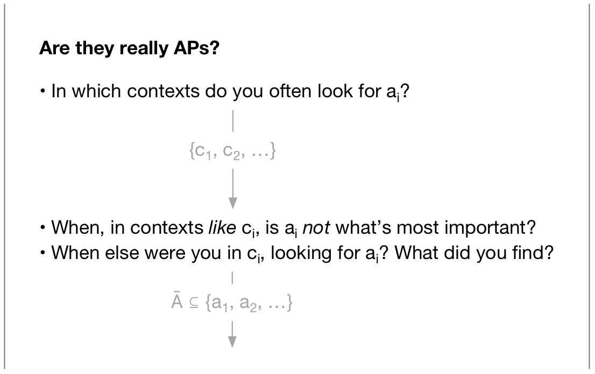
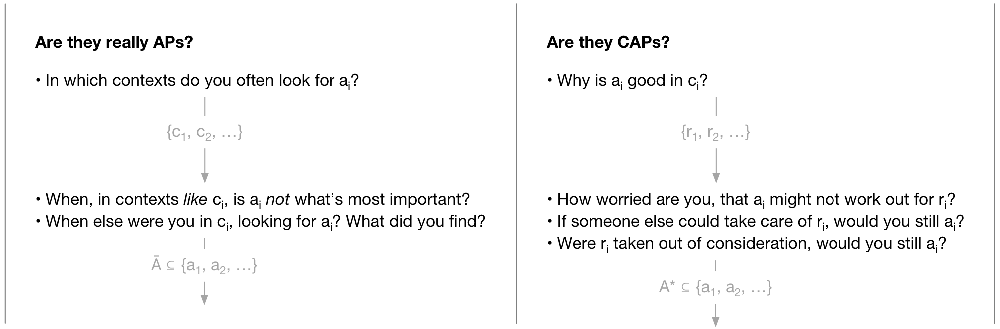
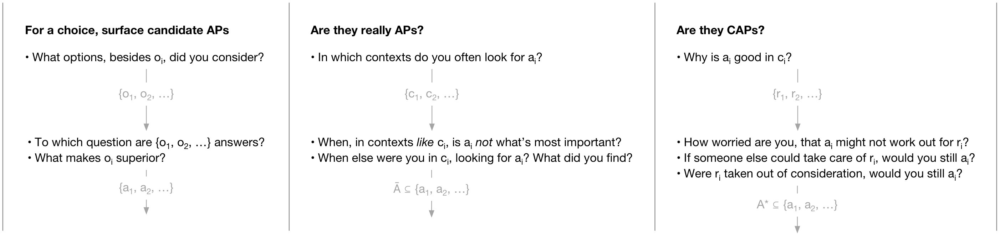

[^joe]: School for Social Design joe.edelman@gmail.com

# Introduction

In his 1938 paper introducing revealed preference, @Samuelson1938 warned:

> I should like to state my personal opinion that nothing said here... touches upon at any point the problem of welfare economics, except in the sense of revealing the confusion in the traditional theory of these distinct subjects.

Similar sentiments followed, in @Arrow1951, @Sen1977, @Anderson2001, etc. As an information basis for welfare, optimality, social choice, etc, revealed preference has been much critiqued.

 All the same, it's hard to see how to move away from it, without paternalism: if people know best for their own lives---shouldn't we trust their choices as the final proof of their intentions? How else can we avoid imposing "better values" from above?

One way to respond is to say that people *do* know best, and have wise values, but that their revealed preferences aren't the last word on those values. But to establish this, you'd want another source of information on people's values---one that retains much of the resolution, robustness, universal applicability, and democratic simplicity of preference.

I'll develop such an information source here, by taking two 'steps back' from revealed preference, widening the information collected. Then I'll argue that my new source corresponds with one definition of "values" used in common speech. Finally, I'll show how this new source can be used in social choice and welfare calculations.

# Preferences

A rich literature covers how revealed preferences---which, when summed up, are called *engagement metrics*---lead us astray. You can often get people to choose something without serving their real interests: you can misinform them, or leverage their misplaced hopes.

Or, you can make it so people *need* your thing for what once was possible without it: they need your car to get to work, your social media account to find a job, your dress to socialize with their friends, etc.

More broadly, you can manufacture social circumstances where people choose your thing to "keep up with the Joneses", to signal allegiance with their tribe, or because they've lost the ability to coordinate a real solution.[See discussions of the prisoner's dilemma in e.g., @Sen1973; @Anderson2001]

In some cases, the person will know their choice doesn't express their true interests---that they are bucking to external pressure, caught in the system, or setting aside their goals to conform to a social rule.[See @Sen1977; @Anderson1993 on 'commitment'] In other cases, options have been limited or biased behind our backs.

Given these problems, why does revealed preference still play a role in notions of benefit and measures of optimality? It has huge advantages as an information source: in the resolution and robustness of the data provided, its near-universal applicability, and the democratic simplicity of its collection:

* Preferences say fine-grained things how about each of us wants to live, informed by our local situations and priorities.
* Preferences get at what we choose in the final analysis, our *real*, battle-tested priorities, not just what we *say* we want.
* Preferences work in many domains of life, and represent all-things-considered judgements, combining morality, prudence, whims, etc.
* Finally, those who aren't introspective or eloquent can still express a preference. And preferences leave simple-to-understand, verifiable trails: purchase histories, voting records, etc.

# Attentional Policies

I'll try to address the problems with preference, holding on to these benefits. To do so, I want to take two 'steps back'. The first step is to widen the conception of choice to include option set formation.

A revealed preference takes the options as given. As other authors have pointed out[@Smaldino2012], this doesn't fully reflect how choice works.

Consider my choice, with colleagues, to say something witty. At $t_1$, I choose to say *that* in particular (over staying silent, or saying my second-place quip). But, at some earlier point $t_0$, I decided to invest my attention in finding witty things to say. I've tried witty phrases on in my mind, and tested situations for witty reframings.

At $t_0$, I made a much bigger choice--I adopted[^adopted] an attentional policy of 'looking for witty quips and reframes'. This is how I assembled the option set for my choice at $t_1$.

I think this earlier choice, at $t_0$, reveals more about me than the latter one. Indeed, these **attentional policies (APs)** might account for much of what's called my "personality": When making friends, am I cautious or bold? When considering a purchase, is my focus on price, quality, or durability? When speaking, do I try to be witty, precise, or down to earth? These may not just be "character traits" I was born with, but policies I adopted, which work together for my way of life.[This characterization of an identity as composed of APs shares something with @Anderson2001; and @Velleman1989]

[^adopted]: I adopt APs (just like I make plans, adopt heuristics, comply with norms, follow through with intentions) because my bounded rationality and social needs make it expedient.[@Bratman1987; @Simon1955; @Taylor2016]

Collecting an agent's APs is part of my proposal to improve the information basis of welfare, social choice, and recommenders. How could that work? You could use an interactive survey to collect the agent's common contexts (socializing, at work, in difficult conversations), and have them pick what they attend to most in each.[^other-methods]

If they claim to have AP $a$ in context $c$, you could verify that with followup questions: First, you could ask them about recent moments in $c$, and what options they've found using $a$. Someone with a policy of vulnerability should be able to cough up various opportunities for vulnerability, recently considered; some taken, some not.

Additionally, that person will also know when *exactly* vulnerability is called for, and when something else takes the fore. I don't try to be vulnerable when giving directions to a stranger, or with my dad. Generally, someone with $a$ in $c$ will have detailed information about the shape of $c$.

Supposing we collected an agent's APs. How would that compare with revealed preference data, in terms of resolution, robustness, universality, and democratic simplicity?

Like preferences, APs are informed by our local situations and priorities, and say fine-grained things about how we want to live. Indeed, they have a higher resolution than I've let on so far: an AP about 'honesty' or 'vulnerability' is always short for a more specific policy, like "attend to what I feel about each thing we discuss, and let my feeling show", or "attend to false impressions a listener may get from my statements, and head them off with a disclaimer". That is: having honesty as a policy requires a substantive interpretation of honesty, and these differ from person to person.

APs are battle-tested. I wish I could craft my words to simultaneously be kind, honest, tactful, humble, and inspiring. I wish I could, at the same moment, be precise in my speech, aware how each word lands, aware of my own feelings; transparent, calm, and centered; passionate; physically graceful, like a dancer. But APs *compete* for my attention. So, my choice to look for witty things to say crowds out many other options.

Like preferences, APs are applicable across all domains in life---the moral, the self-interested, etc, and apply to many kinds of contexts.

But, they score worse on democratic simplicity than revealed preference. And, for now, it's unclear how an agent's APs would provide a substitute for revealed preference. I'll get to that.

[^other-methods]: Social attestations, also, could be a source of AP information: someone who is widely admired for their wit likely has an AP about it. Behavioral data may also work: if someone shops by price or by quality, that may show up in purchase or click data.[Using, perhaps, approaches like @Chang2001; or @Levi1990.]

# Constitutive Judgement

My second 'step back' considers the kind of judgement an agent makes, when they decide to adopt an AP. Look at these three cases:

(@) I watch the road while driving. I don't want to crash.

(@) I'm careful with my speech at work. My boss fires anyone who speaks imprecisely.

(@) I've decided to be more honest with friends. I recently opened up to a friend about a struggle I'm having. Since then, the relationship feels more intimate, and stronger; it's easier for me to think about what to say; my friend is unexpectedly helpful.

In all three examples, the agent notes some benefits of adopting an AP $a$ in a context $c$---benefits like staying alive, keeping my job, and having helpful friends. And in each case, this leads to a decision to adopt it.

But, in the first two examples, those benefits come together to make the case that doing $a$ in $c$ is functional, necessary, prudent, or expedient. The judgement is based on expected costs and benefits, much as a rational choice theorist would hope. I'll call this an *instrumental judgement*.

In example 3, the benefits become supporting evidence for a much larger claim: that honesty with friends is *constitutive* of good relationships^[Good relationships for *this* agent, at least.], or at least naturally goes together with them. The benefits suggest that honesty is going to be part of any relationship I want to build, or is part of the person I want to be---not just that it's functional in achieving certain ends. It's a part-whole claim, or a claim to synergy, not a claim about cause and effect.

I'll call this a *constitutive judgement*. To make one, we ask ourselves questions like: are Xs impossible without Ys? Are Xs without Ys in some way lesser? Are there kinds of wholeness that emerge only when an X has a Y? Note: the evidence that goes into these questions looks *a lot* like costs and benefits (additional kinds of wholeness, etc)! So the raw materials for this judgement are similar, but instead of building an expected value, we build a more general conclusion.

Why do we make constitutive judgements, instead of doing a cost-benefit analysis for everything? Other authors have marked out a role for constitutive judgements in moral reasoning[@Rawls1971], higher-order desires[@Taylor1977], self-understanding [@Velleman1989], and identifying natural kinds [@Boyd1988], but there's also a case to be made from bounded rationality[Following @Simon1955; @Gibson1966; and @Bratman1987]: constitutive judgements are cognitively efficient. Instead of asking each time we have an X, whether we should also have an Y, we ask up-front if Xs and Ys belong together. If we think so, we put Ys in our Xs without considering each case.

Anyways, both kinds of judgement can have errors, and are subject to reconsideration. Instrumental judgements are more delicate, because they depend on a more-or-less complete accounting of costs, benefits, and efficacy. For constitutive judgements, you don't need such a complete accounting: if the benefits you've already noticed line up nicely, you can take them as evidence of a synergy or wholeness. You'll reconsider your judgement only if you start to think you got the overall pattern wrong.

This gives us a way to tell APs resulting from a constitutive judgements (CAPs) from those adopted instrumentally (IAPs). Say an agent uses AP $a$ in context $c$.

First, you can ask her: why is $a$ wise in $c$? Does she gives a small number of reasons, pointing towards one state of the world, $s$, that she's working to achieve, maintain, or ensure (such as 'staying alive', or 'keeping her job')? Or does she gives diffuse, unconnected reasons, and sense she's only *just begun* discovering the benefits of $a$ in $c$?

Second, do the given reasons seem to capture her full rationale? If so, it's likely an IAP. To test this, ask her how she'd feel if they were taken out of consideration (e.g., if she discovered she'd crash anyways, that her speech had no bearing on whether she'd be fired, or that, without opening up to friends, she could magically get the same benefits): Would she select a different AP for $c$ and consider herself better off, free to focus on something else? Similarly, would she consider it a net gain if she could clone herself, and have the clone handle doing $a$ in $c$? Or otherwise automate the achievement of $s$? Or---on the other hand---would she reserve for herself the task of doing $a$ rather than give it to the clone?

Finally, while doing $a$, does she split her attention, putting some attention on how $s$ is going, so that she can reconsider, if needed, the efficacy of $a$ in achieving $s$? Or is her attention is wholly on $a$, with no worry about what she's achieving/maintaining/ensuring?

I've found that these conditions almost always coincide. An AP adopted for diffuse reasons will tend to have someone's whole attention, and they'll be resistant to automating it. A strong sign it's a CAP.

[^values]: In philosophical writing, values are often considered as evaluative criteria or attitudes (@Chang2004, @Velleman1989). My treatment of them as policies works there too, I think: an evaluative attitude or criterion can be viewed as something a person does when making an evaluation or choice. But that's not our topic here.

# Values as CAPs

I want to suggest that an agent's CAPs deserve to be called their values, in at least two everyday[^values] senses of the word. I'll illustrate this with a personal story:

> Earlier in my career, I chose work colleagues for their brilliance, efficacy, and a shared sense of play. One day, with one colleague in particular, I recognized a different thing we shared: we were excited to participate in the same long-term trends. This felt meaningful.

> Later, when choosing teammates, I began to look for this alignment first. My teams now seem more likely to stick together, and we have new types of conversations.

> But even if I knew my teams *wouldn't* last longer, or if those conversations were somehow blocked from happening, I'd still hire with this in mind.

In this story, I gained a CAP. Did I gain a value? I think so. But before going into it, I'll bracket off one common sense of "values" which *doesn't* fit CAPs. I didn't gain a 'social vision': a vision of what's right for everyone, or for a group (e.g., what a family should be like, how a father should behave, what a nation should be like). I didn't gain a political cause (like inclusiveness, freedom, etc), nor a standard to which I'll push others to conform, or try to conform myself (like masculine or feminine dress-codes).

CAPs have little to do with this use of the word "values".[^visions] But, two other uses of the word fit snugly:

First, we use values for the things that feel right and meaningful when you do them---such as being vulnerable, taking stage, being creative, etc. My CAP fits, in this sense.

Second, we use values---in expressions like "the values of science" or "democratic values"---for the individual sources of meaning that keep institutions working. So, a scientist's values might include intellectual humility, passionate pursuit of the truth, etc. Things that are both meaningful for scientists, and needed to keep the institution of science on the rails.

Why do CAPs highlight the latter, which we might call *institutional meanings*? For two reasons: First, they are likely to have been judged constitutive of the practice of science. More importantly, they filter out what's been adopted in that practice for merely instrumental reasons---what's done merely to keep your job, to fit in with colleagues, or to achieve specific goals. So, a scientist's CAPs will not include what they do merely to get tenure, to amass citations, etc. This means CAPs exclude all the perverse incentives (often arising from coordination problems[^collective]) which clutter up institutions, but include what's considered constitutive. Institutional meanings show up clearly.

[^collective]: APs may offer an account for the rationality of collective action---compared to the prisoner's dilemma arguments in @Anderson2001 and @Sen1973. In contrast, my approach follows @Velleman2005, ch 11, closely.

.](i/values.png)

[^visions]: While people often try to be *inclusive* or *feminine* based on such a vision, if this is done merely to spread a social vision, to conform with one, or otherwise to bring about a social change, it's an IAP.

# Meaningful Choice

Finally, I want to suggest that some revealed preferences are more expressive of our values, and should count more in welfare calculations, recommender systems, and social choice.

Consider the preference of Janet, who takes a job at Soulcrushingjobs.com. She says:

> It's the only way my kids can eat. If I didn't go work there, I'd feel a crushing guilt. And my kids might get taken away. Also, I believe in taking responsibility for my family, and this is the way to do that.

We can inquire about her choice of Soulcrushingjobs.com: what APs led Janet towards this option?

1. Let's first verify that "taking responsibility" is a CAP for her. We ask her when that AP is important, and how she decided it's important then. If she knows the context well, and adopted via a constitutive judgement, it's a CAP.

2. Now, we can list options she considered along the way, along with the contexts and APs responsible for surfacing and narrowing those options.Various candidates emerge for the main AP: Was she searching for ways to take responsibility? Or, was she searching for any job to feed her family. These would look very different: if her CAP drove her search, she would have found a wide variety of ways to take responsibility as part of her search. If, on the other hand, she was more focused on finding any job that'd feed her family, we would expect a narrower collection of options.

This makes a huge difference: if Janet's job search was about taking responsibility, she was guided by her values in searching, and we can take her choice as an expression of those values. If, however, her search was driven mainly by IAPs, like trying desperately to feed her family, her it's less about values, and more about a tough situation. She's bucking to external pressure, caught in the system, or setting aside her goals to conform to a social rule.

Should we consider such a choice to be a revealed preference? If anything, Janet's preference is not for soulcrushingjobs.com, but for a better situation, where she *could* choose by her values.

My suggestion is to modify welfare calculations, recommender systems, and social choice to count these choices differently: to collect information about the APs driving a choice, and whether they are CAPs or IAPs, and to restrict the preference relation to only count *meaningful choices*---choices that are expressive of values.[Maintaining the normal structure of welfare economics, see @Bernheim2009.]

This would avoid rewarding actors who rig the game: who force people's hands, tilt the playing field, etc, to drive people towards their option.

A further step would count incidences of meaningful vs. non-meaningful choice as expressing second-order preferences about choice *environments*. A non-meaningful choice is an opportunity to ask the agent if they wish their choice *situation* had been different. This is additional information that could be worked into welfare and social choice (although I'm not sure how).

# Conclusion

The refined preference relation I've described requires additional information from the agent. But this information retains many advantages of revealed preference: it's universally applicable, high-resolution, and robust in the sense that it captures hard-boiled trade-offs.

Where it most clearly falls short, is with what I've called democratic simplicity. CAP-information requires more introspection, more articulacy, and is much harder to verify.

I'm not sure these challenges can be overcome, but there are promising avenues for research:

* Rich, interactive experiences can help people uncover their CAPs,
* CAPs can be inferred from other data,
* Visualizations and cryptography can make CAP data understandable and auditable, so decisions based on meaningful choice can be legitimated.

In many areas, a misalignment between preferences and values plagues our society: clickbait, internet addiction, populist politics, obesity, and various forms of institutional rot. If CAP-based approaches to welfare, recommender systems, and social choice can help, it seems worth the research effort.

# References
